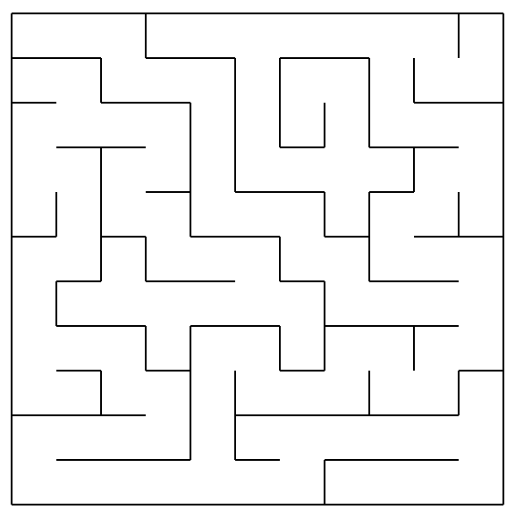

# Maze

Maze random generator on JavaScript.

Check deployment at:
> https://maze.eht.ociotec.com



## Run inside docker container

To run the docker container win an nginx server on port `8888`, just execute:

```
docker run --name maze --detach --publish 8888:80 --restart always ociotec/maze
```

## Build the docker image

Just run:

```
docker image build --tag ociotec/maze .
```
